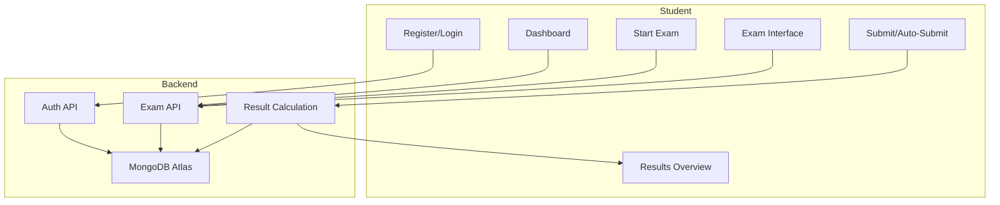

# Student Exam Web Application – Full Architecture & Implementation Plan

---

## 1. Overview

A full-stack web application for students to register, log in, and participate in timed multiple-choice exams. Features include a student dashboard, exam engine with navigation and timer, auto-submit, and detailed results reporting.

---

## 2. Technology Stack & Hosting

- **Frontend:** React (Vite), Material UI or Chakra UI, hosted on Vercel (free tier)
- **Backend:** Node.js/Express, hosted on Render or Railway (free tier)
- **Database:** MongoDB Atlas (free tier)
- **Authentication:** JWT-based, open registration

---

## 3. High-Level Architecture

```mermaid
flowchart TD
    subgraph Frontend [React App (Vercel)]
        A[Landing Page]
        B[Student Dashboard]
        C[Exam Interface]
        D[Results Page]
        E[Settings/Profile]
    end

    subgraph Backend [Node.js/Express (Render/Railway)]
        F[API Endpoints]
        G[Auth (JWT)]
        H[Exam Logic]
        I[Result Calculation]
    end

    subgraph Database [MongoDB Atlas]
        J[Students]
        K[Questions]
        L[Exams]
        M[Results]
    end

    A --> F
    B --> F
    C --> F
    D --> F
    E --> F
    F --> J
    F --> K
    F --> L
    F --> M
    G <--> J
    H <--> K
    H <--> L
    I <--> M
```

---

## 4. Database Schema

### Students Collection

```json
{
  "_id": ObjectId,
  "name": String,
  "email": String,
  "passwordHash": String,
  "createdAt": Date,
  "updatedAt": Date,
  "settings": {
    "theme": String,
    "notifications": Boolean
  }
}
```

### Questions Collection

```json
{
  "_id": ObjectId,
  "text": String,
  "choices": [
    { "option": String, "label": String }
  ],
  "correctAnswer": String,
  "tags": [String],
  "createdAt": Date,
  "updatedAt": Date
}
```

### Exams Collection

```json
{
  "_id": ObjectId,
  "title": String,
  "description": String,
  "questionIds": [ObjectId],
  "durationMinutes": Number,
  "isActive": Boolean,
  "createdAt": Date,
  "updatedAt": Date
}
```

### Results Collection

```json
{
  "_id": ObjectId,
  "studentId": ObjectId,
  "examId": ObjectId,
  "startedAt": Date,
  "submittedAt": Date,
  "answers": [
    {
      "questionId": ObjectId,
      "selectedOption": String,
      "isCorrect": Boolean
    }
  ],
  "score": Number,
  "percentage": Number,
  "detailedReport": {
    "correct": Number,
    "incorrect": Number,
    "unanswered": Number
  }
}
```

---

## 5. Authentication & User Registration

- Open registration (name, email, password)
- Passwords hashed (bcrypt)
- JWT issued on registration/login
- JWT sent in Authorization header for protected API requests
- Optional password reset (future enhancement)
- Security: input validation, rate limiting, JWT secret in env vars

---

## 6. Backend API Endpoints & Exam Logic

- `POST /api/auth/register` — Register
- `POST /api/auth/login` — Login
- `GET /api/students/me` — Get profile
- `PUT /api/students/me` — Update profile
- `GET /api/exams/active` — List active exams
- `GET /api/exams/:id` — Exam details
- `POST /api/exams/:id/start` — Start attempt
- `POST /api/exams/:id/submit` — Submit answers
- `POST /api/exams/:id/quit` — Quit attempt
- `GET /api/results/me` — List attempts
- `GET /api/results/:id` — Detailed report

**Exam Logic:**
- Timer managed on frontend, auto-submit on expiry
- Navigation handled client-side
- Backend validates and scores answers, updates results

---

## 7. Frontend Structure & User Flows

- **Pages:** Landing, Register, Login, Dashboard, Exam, Results, Settings
- **Components:** Auth context, exam navigation, timer, results report, etc.
- **User Flow:**
    - Register/Login → Dashboard → Start Exam → Exam Interface (timer, navigation) → Submit/Auto-submit → Results Overview
- Responsive, accessible UI

---

## 8. Deployment & Hosting

- **Frontend:** Vercel (auto-deploy from GitHub, env vars for API URL)
- **Backend:** Render/Railway (auto-deploy from GitHub, env vars for DB URI, JWT secret, CORS)
- **Database:** MongoDB Atlas (free cluster, secure access)
- **Domains:** Free HTTPS/subdomains, optional custom domain

---

## 9. Step-by-Step Development & Deployment Guide

1. Create GitHub repos for frontend and backend
2. Set up MongoDB Atlas cluster and user
3. Scaffold backend (Node.js/Express), implement models, auth, API, exam logic
4. Scaffold frontend (React/Vite), implement routing, auth, exam UI, results
5. Connect frontend to backend, test locally
6. Deploy backend to Render/Railway, set env vars
7. Deploy frontend to Vercel, set env vars
8. Final testing (register, login, exam, results)
9. (Optional) Add password reset, admin features

---

## 10. Mermaid: High-Level Workflow



---

**This plan is ready for implementation. If you need a Word (.docx) version, you can easily convert this Markdown file using VS Code extensions or online tools.**